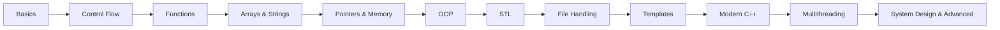

# 🚀 C++ Mastery Roadmap

<p align="center">
  <b>Master C++ from Zero → Advanced System & Software Development</b><br>
  A complete project-based roadmap to become a modern C++ developer.
</p>

<p align="center">
  
  
  
  
</p>

---

## 🧠 About

**C++ Mastery Roadmap** is a structured learning system designed to help you:

✔ Build strong programming fundamentals  
✔ Understand memory & performance deeply  
✔ Master Object-Oriented Programming  
✔ Learn Modern C++ (C++11 → C++23)  
✔ Build real-world applications & systems  
✔ Transition into embedded, robotics, game dev, or backend systems

---

## 🗺️ Roadmap Overview



---

## 🌐 GitHub Pages

Link to GitHub Page - https://srivathsan98.github.io/CPP-Mastery/CPP-Mastery-Tracker.html

---

## 📚 Learning Modules

### 🔰 Basics

* Syntax & structure
* Variables & data types
* Input / Output
* Operators

### 🔁 Control Flow

* Conditions
* Loops
* Switch statements
* Logic building

### 📦 Functions

* Function declarations
* Parameters & return types
* Function overloading
* Recursion

### 🧮 Arrays & Strings

* Arrays
* C-style strings
* `std::string`
* Character manipulation

### 🧷 Pointers & Memory ⚡

> The foundation of performance-focused programming

* Pointers & references
* Dynamic memory
* Stack vs Heap
* Smart pointers
* Memory management

### 🧱 Object-Oriented Programming

* Classes & objects
* Encapsulation
* Inheritance
* Polymorphism
* Abstraction
* Operator overloading

### 📚 STL (Standard Template Library)

* Vectors
* Lists
* Maps
* Sets
* Iterators
* Algorithms

### 📂 File Handling

* Read/write files
* Binary files
* Serialization basics

### 🧩 Templates & Generic Programming

* Function templates
* Class templates
* Template specialization

### ⚙️ Modern C++

* Auto keyword
* Lambda expressions
* Move semantics
* RAII
* Smart pointers
* constexpr
* Structured bindings

### 🧵 Multithreading & Concurrency

* Threads
* Mutex
* Locks
* Condition variables
* Async programming

### 🚀 Advanced Concepts

* Design patterns
* Memory optimization
* Build systems (CMake)
* Low-level debugging
* System programming
* Performance tuning

---

## 🛠️ Projects (Hands-On)

| Project                  | Level        | Description                          |
| ------------------------ | ------------ | ------------------------------------ |
| 🔢 Calculator            | Beginner     | CLI calculator                       |
| 📁 File Manager          | Beginner     | File handling system                 |
| 🧠 Memory Visualizer     | Intermediate | Understand stack & heap visually     |
| 🎮 Mini Game Engine      | Intermediate | OOP + rendering basics               |
| ⚡ Multithreaded Server  | Advanced     | Networking + concurrency             |
| 🔍 Custom STL Container  | Expert       | Rebuild vector/map from scratch      |

---

## 📁 Project Structure

```bash
cpp-mastery/
│
├── 01-basics/
├── 02-control-flow/
├── 03-functions/
├── 04-arrays-strings/
├── 05-pointers-memory/
├── 06-oop/
├── 07-stl/
├── 08-file-handling/
├── 09-templates/
├── 10-modern-cpp/
├── 11-multithreading/
├── 12-advanced/
├── projects/
└── README.md
```

---

## ⚡ Quick Start

```bash
# Clone the repo
git clone https://github.com/Srivathsan98/CPP-Mastery.git

# Enter project
cd CPP-Mastery

# Compile
g++ main.cpp -o main

# Run
./main
```

---

## 🧰 Recommended Tools

| Tool | Purpose |
|------|----------|
| VS Code | Lightweight editor |
| CLion | Professional C++ IDE |
| GCC / Clang | Compilers |
| CMake | Build system |
| GDB | Debugging |
| Valgrind | Memory analysis |

---

## 🎯 Goals

* 🧠 Think like a systems programmer
* ⚙️ Understand memory & performance deeply
* 🧩 Master problem-solving
* 🚀 Build production-grade applications
* 🖥️ Build scalable software systems

---

## 📈 Progress Tracker

* [ ] Basics
* [ ] Control Flow
* [ ] Functions
* [ ] Arrays & Strings
* [ ] Pointers & Memory
* [ ] OOP
* [ ] STL
* [ ] File Handling
* [ ] Templates
* [ ] Modern C++
* [ ] Multithreading
* [ ] Advanced Concepts

---

## 🏆 End Goal

By the end of this roadmap, you should be able to:

✅ Build complex C++ applications  
✅ Understand system-level programming  
✅ Work on robotics & embedded systems  
✅ Develop high-performance software  
✅ Read and contribute to large-scale codebases  
✅ Crack advanced C++ interviews confidently

---

## 🤝 Contributing

Want to improve this roadmap?

1. Fork the repo
2. Create a branch
3. Submit a Pull Request

---

## ⭐ Support

If this helped you:

👉 Star the repo  
👉 Share with others  
👉 Contribute projects & improvements

---

## 📜 License

MIT License

---

<p align="center">
  Built with 💻 + ☕ + curiosity + modern C++
</p>

